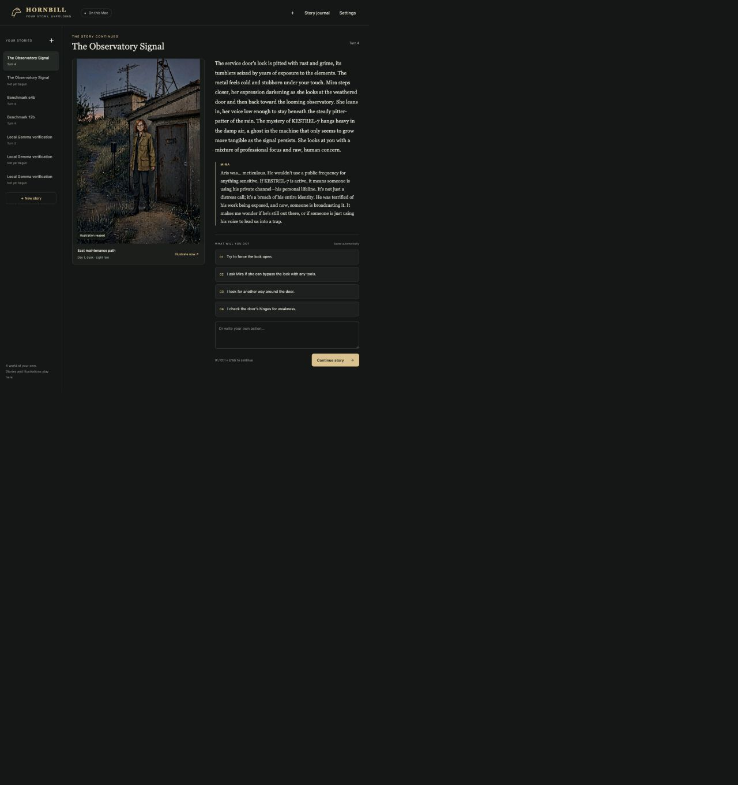

# Hornbill review checkpoint

Checkpoint 0005 is ready for inspection. Feature work is paused at the user's request.

## What works so far

- A local browser interface with saved stories, narration, dialogue, choices and typed actions.
- Gemma 12B and E4B story workers, SQLite validation and automatic saving; GGUF is available as the story compatibility fallback.
- Sequential Qwen illustrations, picture reuse, cancellation and restart/resume.
- Story direction, world notes, summaries, memories and one composition reference attached to a character or place.
- Decoder limits that stop runaway memory lists before invalid output can reach the save. The previously failed action now reaches turn 4 on the first attempt.

The real story/image and reference workflows were exercised. All 35 tests pass. The accepted replay took 117.98 seconds; its complete audit and the rejected attempt are preserved. See [validation and measurements](VALIDATION.md).

## Inspect the existing app

Use the already-open Hornbill browser tab on the development Mac. Select **The Observatory Signal** at **turn 4** (there is also an unused same-title turn-0 test save). Read the narration and choices, then open **Story journal** to inspect its summary, memories, direction, world note and Mira's attached reference. **Settings** currently selects 12B and Smart illustrations, 512×768, seed 42.

The running app has its private access link in local `data/ui-session.json`. That file stays on the Mac. To reopen a stopped app, run `./hornbill ui` from the source directory. A fresh clone contains source and curated evidence; its saves, installed runtimes and model weights need separate local setup as described in the [README](../README.md).

## Next milestone after review

Profile the latest 12B run's 24.14-second grammar compilation and **2.59 GiB increase in system swap**, then compare E4B using the bounded grammar. The system counter includes other applications, so the exact cause remains to be isolated.

Also outstanding are browser export-download verification, clean-install review and longer narrative consistency checks. This is a graphical local MVP checkpoint, not a packaged Tauri release. Reference images guide composition and clothing; exact face identity is not established.

For continuation, read [HANDOFF.md](HANDOFF.md), [WORKLOG.md](WORKLOG.md), [VALIDATION.md](VALIDATION.md) and `drive-log.json`. Resume implementation only after the user's review instruction.
